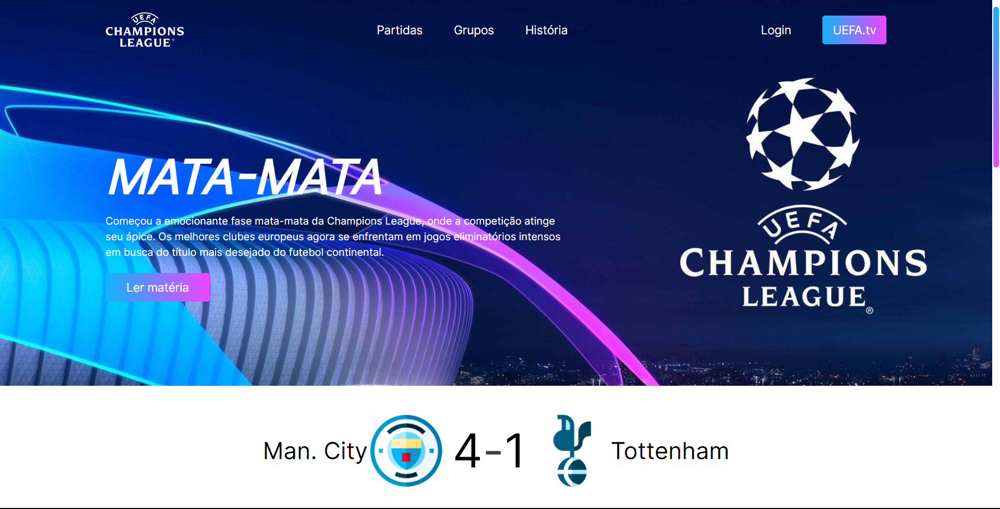

# UEFA Champions League: Onde a Magia Acontece
<div align="center">

</div>

## Descrição
Bem-vindo a este site que reflete a minha paixão pelo futebol. Desde o início, meu objetivo principal foi proporcionar aos usuários uma experiência verdadeiramente cativante, focando sempre na experiência do usuário (UX). 

Espero que, ao navegar por este site você tenha sido envolvido da mesma forma que eu fui pelo futebol. Desejo-o uma boa experiência :) ⚽💖

## Status do projeto
Projeto em andamento.

## Pré-requisitos

- HTML5;
- Tailwind CSS (v3.3.3 ou superior);
- JavaScript (ECMAScript 2022).

## Instalando

1. Clone o repositório para o seu ambiente local:

```
$ git clone https://github.com/igoraugustobrz/ChampionsLeague
```

2. Navegue até o diretório do projeto.

```
$ cd ChampionsLeague
```

## Contribuindo

Contribuições são bem-vindas! Se você quiser contribuir para o projeto, siga as etapas abaixo:

1. Fork o repositório e clone-o para o seu ambiente local.

2. Crie uma nova branch:

```
git checkout -b minha-contribuicao
```

3. Faça as alterações desejadas e commit-as:

```
git commit -m "Minha contribuição"
```

4. Envie suas alterações para o repositório remoto:

```
git push origin minha-contribuicao
```

5. Abra uma solicitação de pull no repositório original.

## Autor

- Igor Augusto
- E-mail: igoraugustobz@gmail.com
- Conecte-se comigo no [LinkedIn](https://www.linkedin.com/in/igorbrz/).